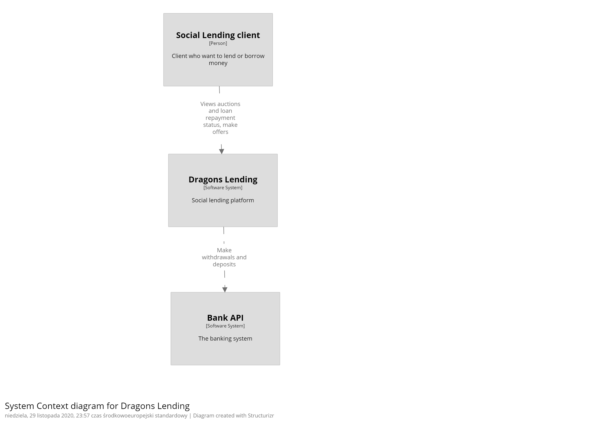

# Table of contents

1. [About](#about)
2. [TODO](#todo)
3. [General assumptions](#general-assumptions)  
    3.1 [Process discovery](#process-discovery)  
    3.2 [Events](#events)    
    3.8 [Architecture](#architecture)  
4. [How to run](#how-to-run)
4. [API documentation](#api-documentation)

## About

This is a project of a social lending platform, driven by 
.

## TODO

- correct tests descriptions
- add some more data fixtures
- update evenstorming diagram
- move auction and offer packages to bidding module and migrate into hexagonal architecture
- displaying user transactions 
- do not allow creating new auction when user has already loans on amount higher than is allowed
- create email notification functionality to inform user about offers, not paid repayments
- add scoring module
- add more functional tests

## General assumptions

### Process discovery

The first thing we started with was domain exploration with the help of EventStorming.  
   

### Project structure
At the very beginning, not to overcomplicate the project, we decided to assign each bounded context
to a separate package, which means that the system is a modular monolith. 

Bounded contexts should (amongst others) introduce autonomy in the sense of architecture. Thus, each module
encapsulating the context has its own local architecture aligned to problem complexity. 
For modules where we discovered complex domain we used hexagonal architecture.
In the case of a context, that during Event Storming turned out to lack any complex
domain logic, we applied CRUD-like local architecture.  

### Events
To make modules more autonomous we tried to communicate with each other with spring events.
Talking about communication between modules, we should know that events reduce coupling, but don't remove
it completely. 
    
### Architecture

To describe architecture in the system and coupling between components we are using C4.

System context 


Container diagram


Component diagram


## How to Run

### Requirements

* Java 11
* Maven
* Postgres or Docker env

### Run locally

When you have local Postgres running you can run the app by simply typing the following:

```console
$ mvn spring-boot:run
```

### Run with Docker-compose

You can run application with database typing:

```console
docker-compose up
```

Please note application will be run with `dev` Spring profile to proper setup BankAPI mock.

### Run integration and functional tests
If you want to start integration or functional tests you need to have running docker environment.

## API documentation
API documentation has been created by a swagger tool and available here:
- locally - http://localhost:8080/swagger-ui.html
- SIT - https://dragons-lending-api.ersa-team.sit.fintechchallenge.pl/swagger-ui.html
- UAT - https://dragons-lending-api.ersa-team.uat.fintechchallenge.pl/swagger-ui.html
- PROD - https://dragons-lending-api.ersa-team.fintechchallenge.pl/swagger-ui.html
